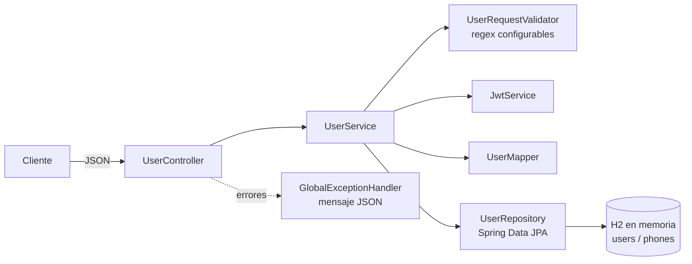
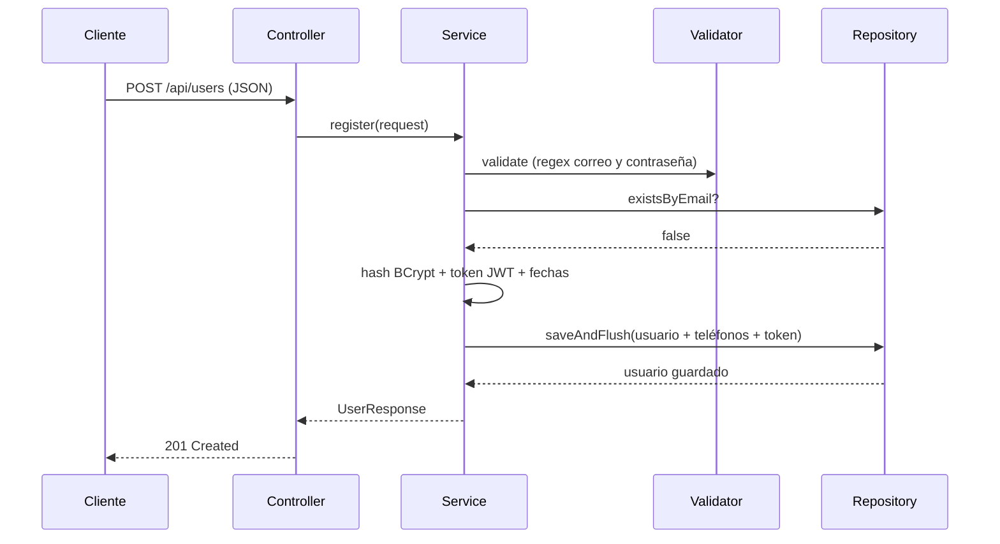

# Users API — Registro de usuarios

API RESTful (Spring Boot 3.5 · JPA/Hibernate · H2 en memoria · Maven · Java 17) para crear usuarios.
Todos los endpoints aceptan y retornan **solo JSON**, incluidos los errores: `{"mensaje": "..."}`.

## Requisitos
- JDK 17
- Maven 3.9+

## Compilar, ejecutar y probar
```bash
mvn clean package        # compila y corre las pruebas
mvn spring-boot:run      # levanta la API en http://localhost:8080
mvn test                 # solo pruebas (unitarias + integración)
```

| Recurso | URL |
|---|---|
| Endpoint de registro | `POST http://localhost:8080/api/users` |
| Consola H2 | http://localhost:8080/h2-console (JDBC: `jdbc:h2:mem:usersdb`, user `sa`, sin clave) |

## Probar con curl
```bash
curl -i -X POST http://localhost:8080/api/users \
  -H "Content-Type: application/json" \
  -d '{"name":"Juan Rodriguez","email":"juan@rodriguez.org","password":"hunter2",
       "phones":[{"number":"1234567","citycode":"1","contrycode":"57"}]}'
```
Respuesta `201 Created`:
```json
{
  "id": "550e8400-e29b-41d4-a716-446655440000",
  "created": "2026-10-01T10:30:00",
  "modified": "2026-10-01T10:30:00",
  "last_login": "2026-10-01T10:30:00",
  "token": "eyJhbGciOiJIUzI1NiJ9...",
  "isactive": true,
  "name": "Juan Rodriguez",
  "email": "juan@rodriguez.org",
  "phones": [{"number": "1234567", "citycode": "1", "contrycode": "57"}]
}
```

## Códigos HTTP
| Escenario | Código | Cuerpo |
|---|---|---|
| Usuario creado | 201 | Usuario + id, created, modified, last_login, token, isactive |
| Correo/contraseña/nombre/teléfono inválido | 400 | `{"mensaje": "..."}` |
| JSON mal formado | 400 | `{"mensaje": "El cuerpo de la petición no es un JSON válido"}` |
| Correo ya registrado | 409 | `{"mensaje": "El correo ya registrado"}` |
| Content-Type distinto de JSON | 415 | `{"mensaje": "..."}` |
| Error inesperado | 500 | `{"mensaje": "Error interno del servidor"}` |

## Configuración (`application.properties`)
| Propiedad | Descripción |
|---|---|
| `app.validation.email-regex` | Regex del correo |
| `app.validation.password-regex` | Regex de la contraseña (**configurable**). Por defecto: mínimo 6 caracteres con al menos una letra y un número |
| `app.jwt.secret` | Clave de firma JWT (≥ 32 caracteres). Sobrescribir con la variable de entorno `JWT_SECRET` |
| `app.jwt.expiration-minutes` | Vigencia del token |

Ejemplo de regex más estricta (8+ caracteres, mayúscula, minúscula y número), sin recompilar:
```bash
APP_VALIDATION_PASSWORDREGEX='^(?=.*[a-z])(?=.*[A-Z])(?=.*[0-9]).{8,}$' mvn spring-boot:run
```

## Base de datos
Script de creación: [`src/main/resources/db/schema.sql`](src/main/resources/db/schema.sql)
(tablas `users` y `phones`). Se ejecuta al iniciar; Hibernate solo valida que coincida con las entidades.

## Arquitectura


Flujo del registro:


## Estructura
```
com.ccpm.users
├── config        AppProperties (config externa), AppConfig (BCrypt)
├── controller    UserController (HTTP)
├── dto           UserRequest, UserResponse, PhoneDto, ErrorResponse
├── exception     excepciones de negocio + GlobalExceptionHandler
├── model         entidades JPA: User, Phone
├── repository    UserRepository
├── security      JwtService
└── service       UserService (lógica), UserRequestValidator, UserMapper
```

## Decisiones de diseño
- **Capas** (controller → service → repository): cada clase tiene una sola responsabilidad.
- **DTOs separados de las entidades**: la contraseña/hash nunca se expone.
- **Contraseña con BCrypt**: no se guarda en texto plano. El **token JWT** sí se persiste, como pide el enunciado.
- **UUID** como id; fechas `created = modified = last_login` en un usuario nuevo (misma variable `now`).
- **409 Conflict** para correo duplicado; además, restricción `UNIQUE` en BD como red de seguridad ante concurrencia.
- **Correo normalizado** a minúsculas para que `A@x.cl` y `a@x.cl` no sean "dos" usuarios.
- Se conserva el nombre `contrycode` tal como pide el enunciado.

## Pruebas
- `UserServiceTest`: pruebas unitarias del servicio con Mockito (registro, duplicado, correo inválido, contraseña inválida, hash BCrypt).
- `UserControllerIT`: prueba de integración con `@SpringBootTest` + MockMvc que levanta Spring + H2 y verifica el contrato JSON y los códigos HTTP (201, 400, 409).
